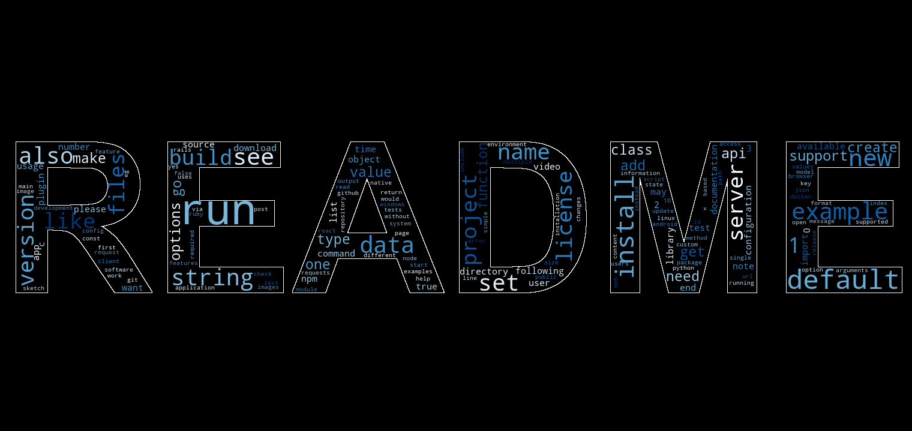
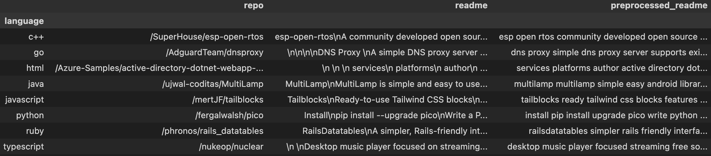

<p style="text-align: center"> 

# **Evaluating GitHub README Files**
</p>

---
 
Zacharia Schmitz<br>
Joshua Click<br>
Aswathy Radha<br>
24 October 2023<br>

<p style="text-align: center;"> 



*Corpus Wordcloud*

--- 


#### Project Plan:

*(Jump To)*

[Project Overview](#overview)

[Data Acquisition](#acquire)

[Preparation](#preparation-data)

[Exploration](#explore)

[Models](#modeling)

[Conclusion](#conclusions)

</p>

---


<br>
<br>

#### From GitHub regarding webscraping and API usage:

#### Rate Limits & Ethics
*from GitHub regarding webscraping and API usage*

[**GitHub Acceptable Use Policies**](https://docs.github.com/en/github/site-policy/github-acceptable-use-policies)
> <br>
>"Short version: We host a wide variety of collaborative projects from all over the world, and that collaboration only works when our users are able to work together in good faith. While using the Service, you must comply with our Acceptable Use Policies, which include some restrictions on content and conduct on GitHub related to user safety, intellectual property, privacy, authenticity, and other limitations. In short, be excellent to each
>other."
> <br> <br>

<br>

---


<br>

## Overview


##### We'll pull 100 README pages for each language.

1. Decide Languages

2. Acquire Repos

3. Data Cleaning

4. Text Preprocessing

5. Feature Extraction

6. Model Training

7. Reusable Functionality

---

### Project Goal

The goal is to build a model that can predict the main programming language of a repository, given the text of the README file.

## Plan → Acquire → Prepare → Explore → Model → Deliver

--- 

### Project Description

- With the Term Frequency-Inverse Document Frequency (TF-IDF) we'll weigh the term frequency (TF) with the inverse document frequency (IDF), which is a weight based on how many documents the word is in.

- We'll utilize the TF-IDF, with our logistic regression model, to predict the language of the README file.

- Once both created, we'll export the TF-IDF and logistic regression as .pkl files to be applied with the created function, to be used on outside of set README strings.

<br>


---


<br>

### Initial Questions / Hypotheses

1. What are the most common words in READMEs?

    - READMEs pertaining to specific languages will have higher frequencies of certain keywords. JavaScript project might frequently mention "Node.js", "npm", or "React".

2. Do different programming languages use a different number of unique words?

    - The mention of specific libraries or frameworks in the README can be indicative of the programming language. For instance, "Django" or "Flask" would be strong indicators for Python.

3. Are there any words that uniquely identify a programming language?

    - Certain phrases might be more commonly associated with specific languages. For example, "front-end" might be more associated with languages like JavaScript, while "data analysis" might be linked to Python or R.

4. Do certain languages have overlapping libraries?

    - The way dependencies are installed and managed can be a hint. Commands like pip install point towards Python, while npm install points towards JavaScript.

<br>

---


<br>

## Acquire
```python
base_url = f"https://github.com/search?q=stars%3A%3E0+language%3A{language}&type=repositories&l={language}&p={page}"


def fetch_readmes(languages=["c++", "go", "html", "java", "javascript", "python", "ruby", "typescript"],
                  num_repos=5,
                  start_page=1,
                  sleep_time=1,
                  verbose=True)
```

**Parameters:**

- `languages (list)`: A list of programming languages to search for.

- `num_repos (int)`: The number of repositories to fetch README files from.

- `start_page (int)`: The page number to start searching from.

- `sleep_time (int)`: The number of seconds to wait between requests.

- `verbose (bool)`: Whether to print progress messages.

### Takeaways from Scraping/API

- Trying to run all 800 at once, we kept failing for different reasons, so we broke it up, and cached each language as we went.

- With 1 second sleeps on 100 requests, we got a 429 status error (too many requests at 42 fetches)
    - We'll have to either chunk it into less pages, or increase sleeps<br><br>

- With 5 second sleeps, 100 repos took 10 minutes 11 seconds total.

- With 2 second sleeps, it took 5:30 and we did not get rate limited.

<br>
<br>

---


<br>

### Pre-Modeling Data Dictionary:

<p style="text-align: center;"> 




### Corpus Information

| Column | Definition |
|--------|-----------|
|`language`|The actual programming language of the repository on GitHub|
|`repo`|The repository location (*h<span>ttps://github.com + **repo** + /blob/master/README.md*)|
|`readme`|The repository prior to the text being processed|
|`preprocessed_readme`|The repository after the text is processed|

 </p>

<br>
<br>

---

## Preparing Data

* Removed all newline characters using the `re.sub` function.

* Removed all URLs using the `re.sub` function.

* Removed all HTML tags using the `re.sub` function.

* Replaced all hyphens with spaces using the `re.sub` function.

* Removed all punctuation characters using a list comprehension and the `string.punctuation` constant.

* Converted the text to lowercase using the `str.lower` method.

* Removed extra white spaces using the `str.split` and `str.join` methods.

* Loaded the list of stopwords using the `stopwords.words` function from the `nltk.corpus` module.

* Adds custom stopwords to the list using the `set.update` method.

* Tokenized the text using the `word_tokenize` function from the `nltk.tokenize` module.

* Removed all stopwords from the list of tokens using a list comprehension.

* Joins the list of tokens back into a string using the `str.join` method.
---
<br>

## Explore

1. What are the most common words in READMEs?

2. Does the length of the README vary by programming language?

3. Do different programming languages use a different number of unique words?

4. Are there any words that uniquely identify a programming language?

<br>
<br>

---


<br>

## Modeling

Utilize GridSearch for best parameters for TF-IDF and LogisticRegression

```python
# Split the data using the new random seed
X_train, X_test, y_train, y_test = train_test_split(df['preprocessed_readme'], df['language'], test_size=0.2, random_state=321)

# Create a pipeline
pipeline = Pipeline([
    ('tfidf', TfidfVectorizer()),
    ('logreg', LogisticRegression(max_iter=1000))
])

# Define the parameter grid
param_grid = {
    'tfidf__max_features': [500, 1000, 5000],
    'tfidf__ngram_range': [(1, 1), (1, 2), (1, 3)],
    'tfidf__min_df': [25, 50, 75],
    'tfidf__max_df': [250, 500, 750],
    'logreg__C': [0.1, 1, 10],
    'logreg__penalty': ['l1', 'l2']
}
```
---

### Best GridSearch:

```python
tfidf = TfidfVectorizer(max_df=250, max_features=500, min_df=25, ngram_range=(1, 2))
logreg = LogisticRegression(C=1, penalty='l2')
```

**Baseline:** 13%

**Best cross-validation score:** 87%

**Train Set:** 84%

**Test Set:** 66%

<br>
<br>

---


<br>

## How to Reproduce:

1. Clone this repo (required CSV is in support_files)

2. Run the notebook.

<i>**Alternatively**</i>

1. The `predict_language()` function is in the last cell of the `final_draft.ipynb`.

2. This can be used on a random README from the dataframe.

3. This can also be used with the `readme_string` key word argument set to a string variable to predict the language.

```python
def predict_language(
    readme_string=None,
    preprocess_func=preprocess_text,
    tfidf_path="support_files/tfidf_vectorizer.pkl",
    logreg_path="support_files/logreg_model.pkl",)
```


<br>
<br>

---

<br>

## Conclusions

### Recommendations

#### For Modeling:

- **Feature Engineering:** Consider extracting additional features from the README text, such as the number of code snippets, mentions of specific libraries, and the use of certain punctuations typical to a programming language.

- **Ensemble Methods:** Combine multiple models for better prediction. For instance, a combination of logistic regression, random forests, and gradient boosting might yield improved results.

- **Deep Learning:** Explore deep learning techniques like RNNs or Transformers (e.g., BERT) which can capture sequential information in the text and might improve accuracy.

- **Regularization:** If overfitting is observed, consider employing stronger regularization techniques or using models with built-in regularization like Ridge or Lasso for logistic regression.

- **Class Imbalance:** If certain languages are underrepresented in the dataset, consider techniques like SMOTE, undersampling, or oversampling to address class imbalance.

- **External Data Sources:** Incorporate external data sources or pre-trained embeddings like Word2Vec or FastText to enhance the representation of the README text.

#### For Data Collection:

- **Diversify Sources:** To avoid biases, collect READMEs from various sources, not just popular repositories, to ensure a diverse representation of projects and languages.

- **Update Data Periodically:** Languages and their ecosystems evolve. Ensure the dataset is updated periodically to reflect recent trends and libraries.

### Next Steps:

- **Validation:** Set up a validation framework to periodically test the model on new READMEs and ensure its predictions remain accurate over time.

- **User Feedback:** If this model is deployed as a tool or service, incorporate user feedback mechanisms to continuously improve it.

- **Expand Scope:** Beyond predicting programming languages, consider expanding the project's scope to categorize projects based on their purpose (e.g., web development, data analysis, gaming).

- **Multilabel Classification:** Some projects use multiple languages. Explore models that can predict multiple languages for a single README.

- **Interactive Dashboard:** Develop an interactive dashboard where users can paste README text and get predictions, insights about the prediction confidence, and even see which parts of the text most influenced the prediction.

- **Continuous Learning:** Implement a continuous learning mechanism where the model gets retrained as more data becomes available or if its performance drops below a certain threshold.

- **Topic Modeling:** Beyond just predicting the language, perform topic modeling on READMEs to identify common themes or topics within specific language communities.